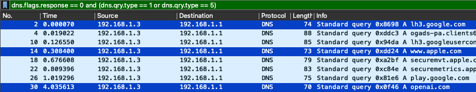
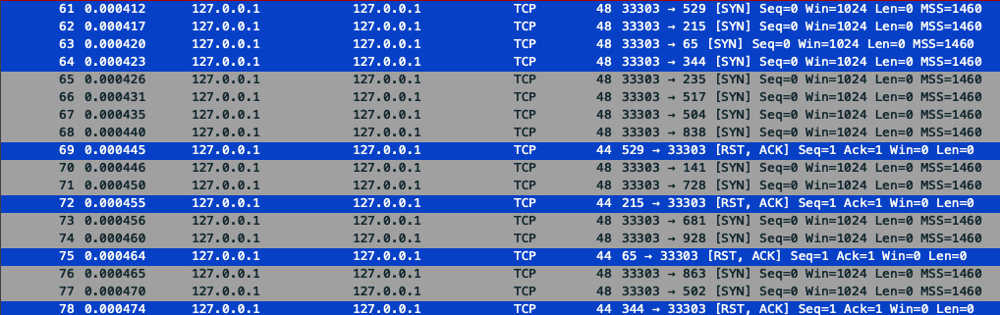

# Scenario
With the v1.0 realease now stable, I ran proper validation tests on the tool and check its capabilities. I'll use different threshold values from the default build so my samples can make more sense.

Remembering: this tool is not adapted to handle professional material, it was built mainly for **learning purposes**, and it does not replace SIEM solutions.

For generating, capturing and analyzing network traffic 3 very well-known tools were used: nmap mainly for port scan, tcpdump with proper filtering(see below), and Wireshark to make a proper analysis and provide PoCs screenshots.

Not a fully ideal scenario but I ran tcpdump and nmap on two different tabs.

## Thresholds
```bash
--port-scan-threshold: 10
--hcv-threshold: 30
--dns-unique-threshold: 3
```

## DNS Queries

### DNS query (noisy one)
This one I didn't care on showing the PoCs because it's not properly filtered, so the sample has not only DNS queries but every other packet flowing through the network.

Very simple tcpdump usage with `-i` followed by the interface, in this case en0(default for MacOS) and `w` followed by the file I want to write the data on.
```bash
sudo tcpdump -i en0 -w dns-queries.pcap
```
### DNS query (less noisy, filtered)
This DNS query is way easier to analyze, not mentioned before but the previous query was almost 4k packets captured in 25s of runtime, this one has `-n` to not resolve domain names, `-U` to flush packet buffer to file sooner and `'udp port 53'` so I capture only packets passing through port 53 and UDP protocol.

```bash
sudo tcpdump -i en0 -n -U -w dns-queries2.pcap 'udp port 53'
```



Although `dns.qry.type == 5` is included in the filter the sample does not have CNAME records at all, only A records.

I generated some network traffic just making up some generic queries for Google, Apple, and OpenAI websites.
Alongside with some API calls, CNAME redirects, and ADs policy being loaded.

## Port scan
In this case I used nmap to generate a solid and valid port scan behavior to trigger the `possible_port_scan` threshold. `-sS` gives me what's called a SYN Stealth scan, `-Pn` treats the host as online and `-p` sets a range of ports to scan, in this case scans ports 1-1000.

Right at the end, the loopback address(it directly impacts on tcpdump, now using lo0 as network interface)
```bash
sudo tcpdump -i lo0 -n -U -w port-scan3.pcap tcp
sudo nmap -sS -Pn -p 1-1000 127.0.0.1
```



This scenario shows only SYN and RST-ACK flags because the ports were closed, the `-sS` scan was used and it does not complete the three-way handshake; but what if we had open ports in this case?

We would see a SYN, SYN-ACK, and RST packets instead.

### Notes
- Thresholds were lowered for PoC visibility.
- All the captures were performed in a controlled local environment.
- Findings are heuristic indicators, not definitive attribution. Real network analysis needs context and more detailed data.

